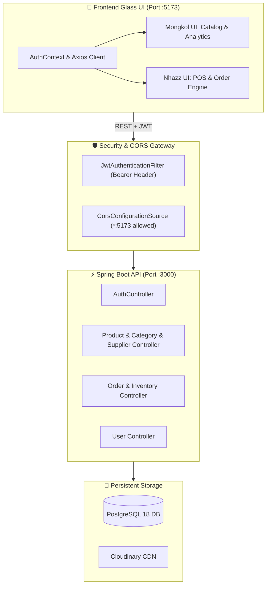

<div align="center">

#  IMS • OS 27
### NEXT-GEN INVENTORY & POS SYSTEM
**Spring Boot 3.x Security Architecture • JJWT 0.12.6 • PostgreSQL 18 • Cloudinary • React 19**

---

```
╔══════════════════════════════════════════════════════════════════════════════════════════╗
║  ● SYSTEM ACTIVE  │  KERNEL: v27.4.0-PRO  │  STATUS: BACKEND VERIFIED  │  CORS: ENABLED  ║
╚══════════════════════════════════════════════════════════════════════════════════════════╝
```

[](file:///d:/Document/CODES%20DEV/SV2-Y3/JAVA%20Y4/JAVA-ETEC/ETEC_SpringBoot_Final/Springboot-final-project/pom.xml)
[](file:///d:/Document/CODES%20DEV/SV2-Y3/JAVA%20Y4/JAVA-ETEC/ETEC_SpringBoot_Final/Springboot-final-project/src/main/java/com/example/inventorymanagementsystem/config/security/SecurityConfig.java)
[](file:///d:/Document/CODES%20DEV/SV2-Y3/JAVA%20Y4/JAVA-ETEC/ETEC_SpringBoot_Final/Springboot-final-project/src/main/resources/application.properties.example)
[](file:///d:/Document/CODES%20DEV/SV2-Y3/JAVA%20Y4/JAVA-ETEC/ETEC_SpringBoot_Final/Springboot-final-project/frontend)

</div>

---

## 🔮 1. System Architecture & Setup Radar



---

## 🔑 2. Pre-Seeded Team Accounts (DataSeeder)

> [!NOTE]
> All accounts are initialized with password `123456` upon application startup. Default registration automatically assigns `ADMIN` privileges.

| Avatar | Identity | Username | Registered Email | Assigned Role | Default PIN / Password |
| :---: | :--- | :--- | :--- | :---: | :---: |
| 👑 | **Mongkol (Dev)** | `mongkol` | `thoeungsereymongkol@gmail.com` | `ROLE_ADMIN` | `123456` |
| ⚡ | **Nhazz (Dev)** | `nhazz` | `manjirokys@gmail.com` | `ROLE_ADMIN` | `123456` |
| 🛡️ | **System SuperAdmin** | `admin` | `admin@gmail.com` | `ROLE_ADMIN` | `123456` |

---

## 💎 3. 50/50 Task Division & Roadmap Matrix

```
┌────────────────────────────────────────┐  ┌────────────────────────────────────────┐
│   👤 MODULE A: MONGKOL                 │  │   👤 MODULE B: NHAZZ                   │
│   Catalog, Media & BI Analytics        │  │   Point-of-Sale, Orders & Admin        │
└────────────────────────────────────────┘  └────────────────────────────────────────┘
```

### 👤 Module A — Mongkol's Scope (`Catalog & Core System`)

- [ ] **A1 • Auth & Gatekeeper UI**
  - Frosted glass login card with ambient background glow.
  - Automatic JWT storage in `localStorage` + Axios request interceptor (`Bearer <token>`).
  - Quick-switch demo account buttons (`mongkol`, `nhazz`, `admin`).
- [ ] **A2 • Executive Dashboard (BI & Analytics)**
  - Dynamic KPI cards: Total Inventory Value, Low-Stock Alerts, Active SKUs, Total Sales.
  - Interactive inventory status indicators (In Stock, Low Warning, Critical Empty).
- [ ] **A3 • Product Catalog & Cloudinary Media Hub**
  - Responsive grid & list view with real-time search and multi-category filters.
  - Product creation & edit modal with instant image preview & Cloudinary upload integration.
- [ ] **A4 • Categories & Suppliers Management**
  - Sleek modal-based CRUD operations.
  - Item counters and supplier contact cards.

---

### 👤 Module B — Nhazz's Scope (`POS, Orders & User Administration`)

- [ ] **B1 • Point of Sale (POS) & Create Order Station**
  - Visual product selection grid with instant barcode/SKU search.
  - Dynamic cart drawer with quantity guards (prevents adding more than available stock).
  - Customer info fields + live tax/total calculator.
  - One-click checkout & instant printable glass invoice / receipt.
- [ ] **B2 • Order Management & Automated Restocking**
  - Interactive Order History table with filterable badges (`PENDING`, `COMPLETED`, `CANCELLED`).
  - Itemized Order Detail modal with line-by-line breakdown.
  - **Cancel Order Action**: Restores deducted inventory quantities instantly via backend transaction.
- [ ] **B3 • User & Access Control Center**
  - Staff management table displaying all system users.
  - Enable/Disable account status switch.
  - Add new staff account with role assignment.

---

## ⚡ 4. Developer Quickstart Guide

### 🚀 Step 1: Boot Up Backend Server (Spring Boot)

```bash
# 1. Pull the latest develop branch
git checkout develop
git pull origin develop

# 2. Verify database connection in application.properties (port 3000)
# spring.datasource.url=jdbc:postgresql://localhost:5432/etec_springboot_final_project
# server.port=3000

# 3. Start Spring Boot backend
./mvnw spring-boot:run
```

> **Backend API URL**: `http://localhost:3000/api`  
> **Swagger UI Docs**: `http://localhost:3000/swagger-ui/index.html`

---

### 💻 Step 2: Boot Up Frontend Development Server (Vite)

```bash
# 1. Navigate to frontend folder
cd frontend

# 2. Install dependencies (React 19, Lucide Icons, Axios, etc.)
npm install

# 3. Run Vite development server
npm run dev
```

> **Frontend Live URL**: `http://localhost:5173`

---

## 📡 5. REST API Command & Response Index

### 🔐 Authentication (`/api/auth`)
- `POST /api/auth/login` $\rightarrow$ `{ "username": "...", "password": "..." }` $\Rightarrow$ Returns `{ token, user }`
- `POST /api/auth/register` $\rightarrow$ `{ "username": "...", "email": "...", "password": "..." }` $\Rightarrow$ Default role is `ADMIN`

### 📦 Products & Catalog (`/api/v1/products`)
- `GET /api/v1/products` $\rightarrow$ List all products (with category & supplier relations)
- `GET /api/v1/products/{id}` $\rightarrow$ Single product detail
- `POST /api/v1/products` $\rightarrow$ Multipart/form-data with image upload (`name`, `price`, `quantity`, `categoryId`, `supplierId`, `imageFile`)
- `PUT /api/v1/products/{id}` $\rightarrow$ Update product details
- `DELETE /api/v1/products/{id}` $\rightarrow$ Remove product

### 🏷️ Categories & Suppliers (`/api/v1/categories`, `/api/v1/suppliers`)
- `GET / POST / PUT / DELETE /api/v1/categories`
- `GET / POST / PUT / DELETE /api/v1/suppliers`

### 🧾 Orders & POS Engine (`/api/v1/orders`)
- `POST /api/v1/orders` $\rightarrow$ Create order & deduct product stock:
  ```json
  {
    "customerName": "Serey Mongkol",
    "customerPhone": "012345678",
    "orderItems": [
      { "productId": 1, "quantity": 2, "unitPrice": 19.99 }
    ]
  }
  ```
- `GET /api/v1/orders` $\rightarrow$ List all orders
- `GET /api/v1/orders/{id}` $\rightarrow$ Full itemized order breakdown
- `PATCH /api/v1/orders/{id}/cancel` $\rightarrow$ Cancel order & **automatically restock** items back to inventory

### 👥 User Administration (`/api/v1/users`)
- `GET /api/v1/users` $\rightarrow$ List all registered users
- `POST /api/v1/users` $\rightarrow$ Create new system user
- `PUT /api/v1/users/{id}` $\rightarrow$ Update user credentials / role
- `DELETE /api/v1/users/{id}` $\rightarrow$ Delete user account

---

## 🎨 6. iOS 27 Aesthetic Tokens & Design Guidelines

```css
/*  iOS 27 Glassmorphism Design Tokens */
:root {
  --ios-bg-canvas: #090A0F;
  --ios-surface-glass: rgba(255, 255, 255, 0.05);
  --ios-surface-glass-hover: rgba(255, 255, 255, 0.08);
  --ios-border-glass: rgba(255, 255, 255, 0.12);
  --ios-blur-intensity: blur(24px) saturate(180%);
  
  /* Luminous Accent Hierarchy */
  --ios-accent-blue: #0A84FF;
  --ios-accent-green: #30D158;
  --ios-accent-pink: #FF375F;
  --ios-accent-purple: #BF5AF2;
  --ios-accent-orange: #FF9F0A;
  
  /* Typography & Shadows */
  --ios-font-primary: -apple-system, BlinkMacSystemFont, "SF Pro Display", "Inter", sans-serif;
  --ios-shadow-glass: 0 16px 36px rgba(0, 0, 0, 0.45);
}
```

### 💫 UI Principles:
1. **Dynamic Micro-Interactions**: Hover scales (`transform: translateY(-2px) scale(1.01)`), smooth 200ms ease transitions.
2. **Visual Hierarchy**: Translucent background cards with subtle high-contrast border outlines (`rgba(255, 255, 255, 0.12)`).
3. **Status Badges**: Pill-shaped glowing badges for stock states (`In Stock: #30D158`, `Low Stock: #FF9F0A`, `Out of Stock: #FF375F`).

---

## 🌿 7. Team Git Workflow Standard

```mermaid
gitGraph
    commit id: "backend-ready"
    branch feature/catalog-mongkol
    branch feature/pos-nhazz
    checkout feature/catalog-mongkol
    commit id: "mongkol-ui-catalog"
    checkout feature/pos-nhazz
    commit id: "nhazz-ui-orders"
    checkout develop
    merge feature/catalog-mongkol id: "merge-mongkol"
    merge feature/pos-nhazz id: "merge-nhazz"
```

### 📋 Git Rules:
1. Always start from up-to-date `develop`:
   ```bash
   git checkout develop
   git pull origin develop
   git checkout -b feature/your-feature-name
   ```
2. Commit with clean prefixes (`feat:`, `fix:`, `style:`, `refactor:`).
3. **NEVER** push `application.properties` or `.env` files containing private credentials.
4. Merge back to `develop` via pull request or verified fast-forward merge.

---

<div align="center">

** ETEC Spring Boot & React Final Project • 2026**  
*Crafted for Excellence by Mongkol & Nhazz*

</div>
