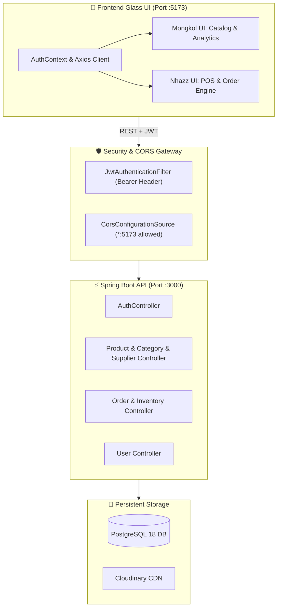

<div align="center">

#  IMS • OS 27
### NEXT-GEN INVENTORY & POS SYSTEM
**Spring Boot 4.1.1 Security Architecture • JJWT 0.12.6 • PostgreSQL 18 • Cloudinary • React 19**

---

```
╔══════════════════════════════════════════════════════════════════════════════════════════╗
║  ● SYSTEM ACTIVE  │  KERNEL: v27.4.0-PRO  │  STATUS: BACKEND VERIFIED  │  CORS: ENABLED  ║
╚══════════════════════════════════════════════════════════════════════════════════════════╝
```

[](file:///d:/Document/CODES%20DEV/SV2-Y3/JAVA%20Y4/JAVA-ETEC/ETEC_SpringBoot_Final/Springboot-final-project/pom.xml)
[](file:///d:/Document/CODES%20DEV/SV2-Y3/JAVA%20Y4/JAVA-ETEC/ETEC_SpringBoot_Final/Springboot-final-project/src/main/java/com/example/inventorymanagementsystem/config/security/SecurityConfig.java)
[](file:///d:/Document/CODES%20DEV/SV2-Y3/JAVA%20Y4/JAVA-ETEC/ETEC_SpringBoot_Final/Springboot-final-project/src/main/resources/application.properties.example)
[](file:///d:/Document/CODES%20DEV/SV2-Y3/JAVA%20Y4/JAVA-ETEC/ETEC_SpringBoot_Final/Springboot-final-project/frontend)

</div>

---

## 🔮 1. System Architecture & Setup Radar



---

## 🔑 2. Pre-Seeded Team Accounts (DataSeeder)

> [!NOTE]
> Seeded team accounts are initialized with password `123456` upon application startup. Public registration always assigns `ROLE_USER`; administrator roles are reserved for seeded or admin-managed accounts.

| Avatar | Identity | Username | Registered Email | Assigned Role | Default PIN / Password |
| :---: | :--- | :--- | :--- | :---: | :---: |
| 👑 | **Mongkol (Dev)** | `mongkol` | `thoeungsereymongkol@gmail.com` | `ROLE_ADMIN` | `123456` |
| ⚡ | **Nhazz (Dev)** | `nhazz` | `manjirokys@gmail.com` | `ROLE_ADMIN` | `123456` |
| 🛡️ | **System SuperAdmin** | `admin` | `admin@gmail.com` | `ROLE_ADMIN` | `123456` |

---

## 💎 3. 50/50 Task Division & Roadmap Matrix

```
┌────────────────────────────────────────┐  ┌────────────────────────────────────────┐
│   👤 MODULE A: MONGKOL                 │  │   👤 MODULE B: NHAZZ                   │
│   Catalog, Media & BI Analytics        │  │   Point-of-Sale, Orders & Admin        │
└────────────────────────────────────────┘  └────────────────────────────────────────┘
```

### 👤 Module A — Mongkol's Scope (`Catalog & Core System`)

- [x] **A1 • Auth & Gatekeeper UI**
  - Frosted glass login card with ambient background glow.
  - Automatic JWT storage in `localStorage` + Axios request interceptor (`Bearer <token>`).
  - Quick-switch demo account buttons (`mongkol`, `nhazz`, `admin`).
- [x] **A2 • Executive Dashboard (BI & Analytics)**
  - Dynamic KPI cards: Total Inventory Value, Low-Stock Alerts, Active SKUs, Total Sales.
  - Interactive inventory status indicators (In Stock, Low Warning, Critical Empty).
- [x] **A3 • Product Catalog & Cloudinary Media Hub**
  - Responsive grid & list view with real-time search, multi-category filters, and live photo counter badges (`📷 N photos`).
  - **Multiple Product Photos Engine**:
    - Upload multiple photos concurrently upon product creation and modification.
    - Interactive in-modal photo gallery with "Cover" badge indicator.
    - Set any uploaded photo as the **Cover/Primary** photo in real-time (`PUT /api/v1/products/{id}/images/primary`).
    - Delete any individual photo instantly from Cloudinary and database with 1-click (`DELETE /api/v1/products/{id}/images`).
    - Dedicated dynamic folder targeting: all product photos go into `etec_springboot_final_project/etec_springboot_final_project_product`.
    - Automatic Cloudinary deletion & cache invalidation when individual photos or entire products are deleted or updated.
    - **POS Compatibility Guaranteed**: The primary photo is synchronized to `imageUrl` so Nhazz's POS and Order modules work seamlessly without any modifications.
- [x] **A4 • Categories, Suppliers & Profile Management**
  - Sleek modal-based CRUD operations for categories and suppliers.
  - Supplier logos stored in `etec_springboot_final_project/etec_springboot_final_project_supplier`.
  - User avatars stored in `etec_springboot_final_project/etec_springboot_final_project_profile`.
  - Automatic old image cleanup on Cloudinary upon logo/avatar replacement or deletion.
  - User signup & profile image management.
- [x] **A5 • Staff & Access Control Dashboard (`Users.jsx`)** *(Taken over by Mongkol)*
  - Full staff directory with dynamic KPI metric cards (Total Accounts, Admins, Standard Users, Cloudinary Avatars).
  - Role management (`ROLE_ADMIN` vs `ROLE_USER`) with 1-click privilege switcher.
  - Create staff modal with validation and customizable role assignment.
  - Edit staff modal with optional password updating (keeps password unchanged if blank).
  - Cloudinary profile picture uploads directly by user ID (`POST /api/v1/users/{id}/avatar`).
  - Self-deletion guard protecting active admin session.
  - Protected behind `adminOnly` route in `App.jsx` and added to `Sidebar.jsx`.

---

### 👤 Module B — Nhazz's Scope (`POS, Storefront & Orders`)

- [ ] **B1 • Point of Sale (POS), Storefront & Shopping Cart**
  - Visual product selection grid connected to live `productService.getAll()`.
  - Upgrade `ProductCard.jsx` to Apple `#1D1D1F` styling with `object-contain` images.
  - Dynamic cart drawer (`CartDrawer.jsx`) with quantity guards (prevents adding more than available stock).
  - Checkout modal (`CheckoutModal.jsx`) calling `orderService.create()`.
- [ ] **B2 • Order Management & Automated Restocking**
  - Fix `@Transactional(readOnly = true)` bug in `OrderServiceImpl.java`.
  - Interactive Order History table (`Orders.jsx`) with filterable badges (`PENDING`, `COMPLETED`, `CANCELLED`).
  - **Cancel Order Action**: Restores deducted inventory quantities instantly via backend transaction.

---

## ⚡ 4. Developer Quickstart Guide

### 🚀 Step 1: Boot Up Backend Server (Spring Boot)

```bash
# 1. Pull the latest develop branch
git checkout develop
git pull origin develop

# 2. Verify database connection in application.properties (port 3000)
# spring.datasource.url=jdbc:postgresql://localhost:5432/etec_springboot_final_project
# server.port=3000

# 3. Start Spring Boot backend
./mvnw spring-boot:run
```

> **Backend API URL**: `http://localhost:3000/api`  
> **Swagger UI Docs**: `http://localhost:3000/swagger-ui/index.html`

---

### 💻 Step 2: Boot Up Frontend Development Server (Vite)

```bash
# 1. Navigate to frontend folder
cd frontend

# 2. Install dependencies (React 19, Lucide Icons, Axios, etc.)
npm install

# 3. Run Vite development server
npm run dev
```

> **Frontend Live URL**: `http://localhost:5173`

---

## 📡 5. REST API Command & Response Index

### 🔐 Authentication (`/api/auth`)
- `POST /api/auth/login` $\rightarrow$ `{ "username": "...", "password": "..." }` $\Rightarrow$ Returns `{ token, user }`
- `POST /api/auth/register` $\rightarrow$ `{ "username": "...", "email": "...", "password": "..." }` $\Rightarrow$ Default role is `ROLE_USER`

### 📦 Products & Catalog (`/api/v1/products`)
- `GET /api/v1/products` $\rightarrow$ List all products (returns `imageUrl` for POS cover + `images: [...]` list)
- `GET /api/v1/products/{id}` $\rightarrow$ Single product detail with full `images` array
- `POST /api/v1/products` $\rightarrow$ Multipart/form-data with multi-image support (`files` list or single `file`, `name`, `price`, `quantity`, `categoryId`, `supplierId`)
- `PUT /api/v1/products/{id}` $\rightarrow$ Update product details with optional additional photos (`files`)
- `POST /api/v1/products/{id}/images` $\rightarrow$ Multipart/form-data to upload additional photos directly
- `DELETE /api/v1/products/{id}/images?imageUrl={url}` $\rightarrow$ Delete a single photo from Cloudinary & entity
- `PUT /api/v1/products/{id}/images/primary?imageUrl={url}` $\rightarrow$ Set a specific photo as the primary cover
- `DELETE /api/v1/products/{id}` $\rightarrow$ Remove product and purge all its photos from Cloudinary

### 🏷️ Categories & Suppliers (`/api/v1/categories`, `/api/v1/suppliers`)
- `GET / POST / PUT / DELETE /api/v1/categories`
- `GET / POST / PUT / DELETE /api/v1/suppliers`

### 🧾 Orders & POS Engine (`/api/v1/orders`)
- `POST /api/v1/orders` $\rightarrow$ Create order & deduct product stock:
  ```json
  {
    "customerName": "Serey Mongkol",
    "customerPhone": "012345678",
    "orderItems": [
      { "productId": 1, "quantity": 2, "unitPrice": 19.99 }
    ]
  }
  ```
- `GET /api/v1/orders` $\rightarrow$ List all orders
- `GET /api/v1/orders/{id}` $\rightarrow$ Full itemized order breakdown
- `PATCH /api/v1/orders/{id}/cancel` $\rightarrow$ Cancel order & **automatically restock** items back to inventory

### 👥 User Administration (`/api/v1/users`)
- `GET /api/v1/users` $\rightarrow$ List all registered users
- `POST /api/v1/users` $\rightarrow$ Create new system user
- `PUT /api/v1/users/{id}` $\rightarrow$ Update user credentials / role
- `DELETE /api/v1/users/{id}` $\rightarrow$ Delete user account

> User-management endpoints and catalog mutations require `ROLE_ADMIN`. Authenticated users may read catalog data, while profile access is restricted to the current user or an administrator.

## Current Role and Route Model

- Public `/` renders the blank landing page without requiring an account.
- Standard users are redirected to `/landing` after login and use the navbar-only layout.
- Administrators are redirected to `/dashboard` and use the management sidebar.
- Admin-only pages: `/dashboard`, `/categories`, `/suppliers`, and `/users`.
- Shared authenticated pages: `/products`, `/pos`, and `/profile`.
- The role and page-access updates were merged from `Mongkol7` into `develop`.

---

## 🎨 6. Apple Clean Aesthetic Tokens & Design Guidelines

```css
/*  Apple Website Clean Design Tokens */
:root {
  --apple-bg: #f5f5f7;                        /* Athens Gray canvas */
  --apple-surface: #ffffff;                   /* Pure white card surface */
  --apple-border: rgba(0, 0, 0, 0.08);        /* Subtle Apple border */
  --apple-border-hover: rgba(0, 0, 0, 0.16);  /* Dynamic hover border */

  /* Apple Primary Interactive Accent (#1D1D1F signature dark slate) */
  --apple-primary: #1d1d1f;                   /* Primary CTA buttons & active tabs */
  --apple-primary-hover: #333336;             /* Smooth hover transition */
  --apple-primary-active: #000000;            /* Click depression state */

  /* Apple System Status Accents */
  --apple-green: #30d158;                     /* In Stock / Success */
  --apple-orange: #ff9f0a;                    /* Low Stock / Warning */
  --apple-red: #ff3b30;                       /* Out of Stock / Danger */

  /* Typography & Enhanced Depth Shadows */
  --apple-font: -apple-system, BlinkMacSystemFont, "SF Pro Display", "SF Pro Text", sans-serif;
  --apple-shadow-resting: 0 4px 16px -2px rgba(0, 0, 0, 0.07), 0 2px 6px -1px rgba(0, 0, 0, 0.04);
  --apple-shadow-hover: 0 16px 32px -4px rgba(0, 0, 0, 0.12), 0 4px 12px -2px rgba(0, 0, 0, 0.06);
  --apple-shadow-modal: 0 20px 60px rgba(0, 0, 0, 0.18);
  --apple-shadow-btn: 0 4px 14px 0 rgba(0, 0, 0, 0.18);
}
```

### 💫 UI Principles:
1. **Dynamic Micro-Interactions**: Hover elevation (`transform: translateY(-2px)`), smooth 200ms ease transitions (`cubic-bezier(0.16, 1, 0.3, 1)`).
2. **Visual Hierarchy & Depth**: Frosted glass panels (`background: rgba(255, 255, 255, 0.92)` with `backdrop-filter: blur(20px)`) over an Athens Gray `#f5f5f7` canvas with enhanced shadow depth.
3. **Pill-Shaped CTAs**: Action buttons and active route pills styled in solid `#1D1D1F` with high-contrast pure white text/icons.
4. **Status Badges**: Pill-shaped translucent badges for stock states (`In Stock: #30D158`, `Low Stock: #FF9F0A`, `Out of Stock: #FF375F`).

---

## 🌿 7. Team Git Workflow Standard

```mermaid
gitGraph
    commit id: "backend-ready"
    branch feature/catalog-mongkol
    branch feature/pos-nhazz
    checkout feature/catalog-mongkol
    commit id: "mongkol-ui-catalog"
    checkout feature/pos-nhazz
    commit id: "nhazz-ui-orders"
    checkout develop
    merge feature/catalog-mongkol id: "merge-mongkol"
    merge feature/pos-nhazz id: "merge-nhazz"
```

### 📋 Git Rules:
1. Always start from up-to-date `develop`:
   ```bash
   git checkout develop
   git pull origin develop
   git checkout -b feature/your-feature-name
   ```
2. Commit with clean prefixes (`feat:`, `fix:`, `style:`, `refactor:`).
3. **NEVER** push `application.properties` or `.env` files containing private credentials.
4. Merge back to `develop` via pull request or verified fast-forward merge.

---

<div align="center">

** ETEC Spring Boot & React Final Project • 2026**  
*Crafted for Excellence by Mongkol & Nhazz*

</div>
